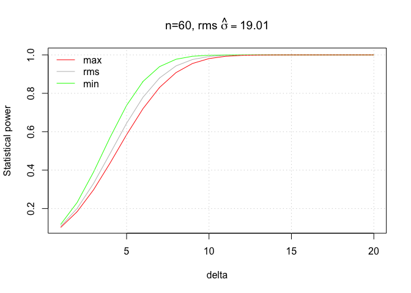

Visualise fresh weight
================

## Background

Kris Kramer-Walter and Patrick Snelgar have conducted a study of 9 G3
vines from flowering fruit harvest, the entire population of fruit were
stripped off each vine in 2020, fruit were then destructively assessed
in the fast lab. Three different canopy structure treatments
(Conventional Spur, Strung) were replicated over three vines.

This data set provides the entire population of fruit weights in 2020,
and the underlying sampling distribution for G3, a control for the Gold
programme. From this data set we can examine the underlying within vine
variability of fruit weights;

Tabulating Numbers of fruit per vine assessed by Vine and Treatment;

``` r
knitr::kable(with(all_fruit_data, table(VineUUID, VineTreatmentNoNumber)))
```

|        | Conventional | Spur | Strung |
| :----- | -----------: | ---: | -----: |
| Vine 1 |          774 |    0 |      0 |
| Vine 2 |            0 |    0 |   1043 |
| Vine 3 |            0 | 1020 |      0 |
| Vine 4 |         1103 |    0 |      0 |
| Vine 5 |            0 | 1326 |      0 |
| Vine 6 |            0 |    0 |   1159 |
| Vine 7 |            0 | 1237 |      0 |
| Vine 8 |            0 |    0 |   1269 |
| Vine 9 |         1024 |    0 |      0 |

## Exploratory analysis

Visualizing the Fresh weight using histograms, conditioned on each Vine,
Treatment, and collapsed over Vines;

``` r
histogram(~ FreshWeight | VineUUID, data=all_fruit_data, scales=list(alternating=FALSE), between=list(x=0.3, y=0.3),
          breaks=30, layout=c(3,3), panel=function(x, subscripts, groups, ...){
            panel.histogram(x, ...)
            panel.abline(v=90, lty=3, col="red", lwd=1.5)
            thres_frac <- sum(x<=90, na.rm=TRUE) / length(x)
            panel.text(50, 12, paste0(round(100*thres_frac,2), "%"), cex=0.5)
          })
```

<!-- -->

``` r
histogram(~ FreshWeight | VineTreatmentNoNumber, data=all_fruit_data,
          aspect=1, main="Collapsing over replicate Vines", 
          scales=list(alternating=FALSE), between=list(x=0.3, y=0.3), breaks=30, layout=c(3,1), panel=function(x, subscripts, groups, ...){
            panel.histogram(x, ...)
            panel.abline(v=90, lty=3, col="red", lwd=1.5)
            thres_frac <- sum(x<=90, na.rm=TRUE) / length(x)
            panel.text(50, 10, paste0(round(100*thres_frac,2), "%"), cex=0.6)
          })
```

<!-- -->

``` r
histogram(~ FreshWeight, data=all_fruit_data, scales=list(alternating=FALSE), 
          between=list(x=0.3, y=0.3), breaks=30, main="Collapsing over all Vines",
          panel=function(x, subscripts, groups, ...){
            panel.histogram(x, ...)
            panel.abline(v=90, lty=3, col="red", lwd=1.5)
            thres_frac <- sum(x<=90, na.rm=TRUE) / length(x)
            panel.text(50, 10, paste0(round(100*thres_frac,2), "%"))
          })
```

<!-- -->

## Summary statistics

Summary statistics for each vine;

``` r
sum_vine <- cbind(Vine=levels(all_fruit_data$VineUUID), unname(do.call(rbind.data.frame, with(all_fruit_data, tapply(FreshWeight,  VineUUID, summary)))))
colnames(sum_vine) <- c("Vine", "Min", "1st Qu", "Median","Mean", "3rd Qu", "Max", "NA's")
knitr::kable(sum_vine)
```

| Vine   |   Min |  1st Qu |  Median |     Mean |   3rd Qu |    Max | NA’s |
| :----- | ----: | ------: | ------: | -------: | -------: | -----: | ---: |
| Vine 1 | 64.48 | 113.660 | 127.950 | 126.9431 | 139.3700 | 192.23 |    7 |
| Vine 2 | 51.31 | 106.935 | 118.530 | 118.3720 | 129.7950 | 171.87 |   10 |
| Vine 3 | 33.63 | 107.595 | 122.860 | 121.5954 | 135.7300 | 189.49 |    1 |
| Vine 4 | 50.69 | 108.525 | 121.930 | 122.3091 | 135.0200 | 205.60 |    4 |
| Vine 5 | 51.81 | 100.320 | 114.450 | 114.7669 | 128.5000 | 211.49 |   18 |
| Vine 6 | 48.32 | 101.705 | 112.510 | 113.1478 | 124.5175 | 196.02 |   52 |
| Vine 7 | 65.23 | 103.310 | 117.230 | 116.6303 | 129.2800 | 168.47 |   22 |
| Vine 8 | 50.59 |  97.800 | 110.965 | 111.2160 | 123.5650 | 207.70 |   15 |
| Vine 9 | 59.13 | 105.955 | 116.945 | 117.0007 | 128.0775 | 192.31 |   18 |

Standard deviations within Vines;

``` r
sd_vine <- with(all_fruit_data, tapply(FreshWeight,  VineUUID, sd, na.rm=TRUE))
knitr::kable(sd_vine,  col.names=c("sd(X)"))
```

|        |    sd(X) |
| :----- | -------: |
| Vine 1 | 19.40376 |
| Vine 2 | 16.79510 |
| Vine 3 | 20.60119 |
| Vine 4 | 20.40306 |
| Vine 5 | 20.22703 |
| Vine 6 | 17.66092 |
| Vine 7 | 18.18912 |
| Vine 8 | 20.24913 |
| Vine 9 | 17.02309 |

The range of standard deviations across the 9 Vines is;

``` r
range(sd_vine)
```

    ## [1] 16.79510 20.60119

and the average [RMS](https://en.wikipedia.org/wiki/Root_mean_square)
standard deviation is;

``` r
sqrt(mean(sd_vine^2))
```

    ## [1] 19.00577

These summary statistics appear to be consistent with [Kiwifruit fruit
size distributions, K. J. McAneney, A. C. Richardson, A. E.
Green](https://www.tandfonline.com/doi/pdf/10.1080/01140671.1989.10428047)

The coefficient of variation is a useful metric, a value closer to 0
indicates higher signal to noise ratio.

``` r
with(all_fruit_data, tapply(FreshWeight,  VineUUID, sd, na.rm=TRUE) / 
       tapply(FreshWeight,  VineUUID, mean, na.rm=TRUE))
```

    ##    Vine 1    Vine 2    Vine 3    Vine 4    Vine 5    Vine 6    Vine 7    Vine 8 
    ## 0.1528540 0.1418840 0.1694241 0.1668156 0.1762444 0.1560871 0.1559554 0.1820703 
    ##    Vine 9 
    ## 0.1454956

For different Genotypes within families with smaller fruit sizes, a
reasonable assumption to make is that the coefficient of variation would
be similar to coefficient of variation values observed above.

## Statistical Power

Using underlying standard deviation information we can estimate
statistical power based on a desired difference to detect.


Assuming we have a sample to compare to G3 as a positive control, and
the variability is similar, we can estimate power required using a two
sided t-test to examine if there is a statistical difference between the
samples. Using the empirical median standard deviation which is the
standard deviation for at least 50% of the samples;

Sampling n=60;

``` r
delta <- 1:20
    n <- 60

min_sd <- min(sd_vine)    
rms_sd <- sqrt(mean(sd_vine^2))
max_sd <- max(sd_vine)

delta_min <- lapply(delta, function(x)power.t.test(n=n, sd=min_sd, sig.level=0.05, delta=x, type = "two.sample", alternative="two.sided"))
delta_rms <- lapply(delta, function(x)power.t.test(n=n, sd=rms_sd, sig.level=0.05, delta=x, type = "two.sample", alternative="two.sided"))
delta_max <- lapply(delta, function(x)power.t.test(n=n, sd=max_sd, sig.level=0.05, delta=x, type = "two.sample", alternative="two.sided"))


plot(delta, sapply(delta_rms, function(x)x$power), type="l", col="grey", ylab="Statistical power", main=substitute(paste("n=", n, ", rms ", hat(sigma)==x), list(n=n, x=round(rms_sd, 2))))
lines(delta, sapply(delta_min, function(x)x$power), col="green")
lines(delta, sapply(delta_max, function(x)x$power), col="red")

grid()
legend("topleft",legend = c("max", "rms", "min"), col=c("red","grey", "green"), lty=1, bty="n")
```

<!-- -->

Sampling n=40;

``` r
delta <- 1:20
    n <- 40

min_sd <- min(sd_vine)    
rms_sd <- sqrt(mean(sd_vine^2))
max_sd <- max(sd_vine)

delta_min <- lapply(delta, function(x)power.t.test(n=n, sd=min_sd, sig.level=0.05, delta=x, type = "two.sample", alternative="two.sided"))
delta_rms <- lapply(delta, function(x)power.t.test(n=n, sd=rms_sd, sig.level=0.05, delta=x, type = "two.sample", alternative="two.sided"))
delta_max <- lapply(delta, function(x)power.t.test(n=n, sd=max_sd, sig.level=0.05, delta=x, type = "two.sample", alternative="two.sided"))


plot(delta, sapply(delta_rms, function(x)x$power), type="l", col="grey", ylab="Statistical power", main=substitute(paste("n=", n, ", rms ", hat(sigma)==x), list(n=n, x=round(rms_sd, 2))))
lines(delta, sapply(delta_min, function(x)x$power), col="green")
lines(delta, sapply(delta_max, function(x)x$power), col="red")

grid()
legend("topleft",legend = c("max", "rms", "min"), col=c("red","grey", "green"), lty=1, bty="n")
```

<!-- -->

## Estimating variance components

Using lmer to obtain a reml model;

``` r
m2 <- lmer(FreshWeight ~ VineTreatmentNoNumber + (VineTreatmentNoNumber | VineUUID), data=all_fruit_data)
summary(m2)
```

    ## Linear mixed model fit by REML ['lmerMod']
    ## Formula: FreshWeight ~ VineTreatmentNoNumber + (VineTreatmentNoNumber |  
    ##     VineUUID)
    ##    Data: all_fruit_data
    ## 
    ## REML criterion at convergence: 86103.2
    ## 
    ## Scaled residuals: 
    ##     Min      1Q  Median      3Q     Max 
    ## -4.6133 -0.6772  0.0089  0.6534  5.0761 
    ## 
    ## Random effects:
    ##  Groups   Name                        Variance Std.Dev. Corr       
    ##  VineUUID (Intercept)                  24.32    4.932              
    ##           VineTreatmentNoNumberSpur    14.70    3.834   -0.71      
    ##           VineTreatmentNoNumberStrung  15.37    3.920   -0.68  0.59
    ##  Residual                             362.65   19.043              
    ## Number of obs: 9859, groups:  VineUUID, 9
    ## 
    ## Fixed effects:
    ##                             Estimate Std. Error t value
    ## (Intercept)                  122.077      2.870  42.540
    ## VineTreatmentNoNumberSpur     -4.423      3.519  -1.257
    ## VineTreatmentNoNumberStrung   -7.837      3.578  -2.191
    ## 
    ## Correlation of Fixed Effects:
    ##                 (Intr) VnTrtmntNNmbrSp
    ## VnTrtmntNNmbrSp -0.815                
    ## VnTrtmntNNmbrSt -0.802  0.654

### Fixed effects

Investigating methods, conventional is slightly better than Spur which
is slightly better than Strung.

``` r
 get_parameters(m2)
```

    ##                     Parameter   Estimate
    ## 1                 (Intercept) 122.076950
    ## 2   VineTreatmentNoNumberSpur  -4.422920
    ## 3 VineTreatmentNoNumberStrung  -7.836943

### Random effects

Variance components between Vines (3 per Treatment level) within
Treatments;

``` r
c(get_variance_intercept(m2), get_variance_slope(m2))
```

    ##                         var.intercept.VineUUID 
    ##                                       24.31987 
    ##   var.slope.VineUUID.VineTreatmentNoNumberSpur 
    ##                                       14.70186 
    ## var.slope.VineUUID.VineTreatmentNoNumberStrung 
    ##                                       15.36635

Residual standard deviation within Vines is;

``` r
sqrt(unname(get_variance_residual(m2)))
```

    ## [1] 19.04325

## Sampling Distribution

As we have the entire population of fruit picked and assessed for these
9 Vines, we have the underlying sampling distribution. This distribution
visually appears similar to an underlying normal distribution, testing
for normality using normal Q-Q plots conditioned by Vine;

``` r
qqmath(~ FreshWeight | VineUUID, data=all_fruit_data,
       distribution = function(p) qnorm(p, mean=0, sd=1), main="Normal Q-Q Plot",
       ylab="Sample Quantiles", xlab="Theoretical quantiles",
       scales=list(alternating=FALSE), between=list(x=0.3, y=0.3),
       breaks=30, layout=c(3,3), pch=16, cex=0.5, aspect=1,
      prepanel = prepanel.qqmathline,
       panel = function(x, ...) {
         panel.qqmath(x, ...)
         panel.qqmathline(x, ...)
       })
```

<!-- -->

Testing for normality using normal Q-Q plots by Treatment collapsing
over replicates;

``` r
qqmath(~ FreshWeight | VineTreatmentNoNumber, data=all_fruit_data,
       distribution = function(p) qnorm(p, mean=0, sd=1), main="Normal Q-Q Plot",
       ylab="Sample Quantiles", xlab="Theoretical quantiles",
       scales=list(alternating=FALSE), between=list(x=0.3, y=0.3),
       breaks=30, layout=c(3,1), pch=16, cex=0.5, aspect=1,
      prepanel = prepanel.qqmathline,
       panel = function(x, ...) {
         panel.qqmath(x, ...)
         panel.qqmathline(x, ...)
       })
```

<!-- -->

Testing for normality using normal Q-Q plots collapsing over all Vines;

``` r
qqmath(~ FreshWeight, data=all_fruit_data,
       distribution = function(p) qnorm(p, mean=0, sd=1), main="Normal Q-Q Plot",
       ylab="Sample Quantiles", xlab="Theoretical quantiles",
       scales=list(alternating=FALSE), between=list(x=0.3, y=0.3),
       breaks=30, pch=16, cex=0.5, aspect=1,
      prepanel = prepanel.qqmathline,
       panel = function(x, ...) {
         panel.qqmath(x, ...)
         panel.qqmathline(x, ...)
       })
```

<!-- -->

## Bootstrapping

``` r
tmp <- all_fruit_data[all_fruit_data$VineUUID%in%"Vine 2" & !is.na(all_fruit_data$FreshWeight), ]

#sample(tmp$FreshWeight, 40)

hist(replicate(10000,  mean(sample(tmp$FreshWeight, 40))), breaks=30)
```

<!-- -->

``` r
hist(replicate(10000,  sd(sample(tmp$FreshWeight, 40))), breaks=30)
```

<!-- -->

``` r
qqplot(replicate(10000,  var(sample(tmp$FreshWeight, 40))), rchisq(1000, 40-1))
abline(0,1)
```

<!-- -->

``` r
hist(replicate(10000,  mean(sample(tmp$FreshWeight, 60))), breaks=30)
```

<!-- -->

``` r
hist(replicate(10000,  sd(sample(tmp$FreshWeight, 60))), breaks=30)
```

<!-- -->
