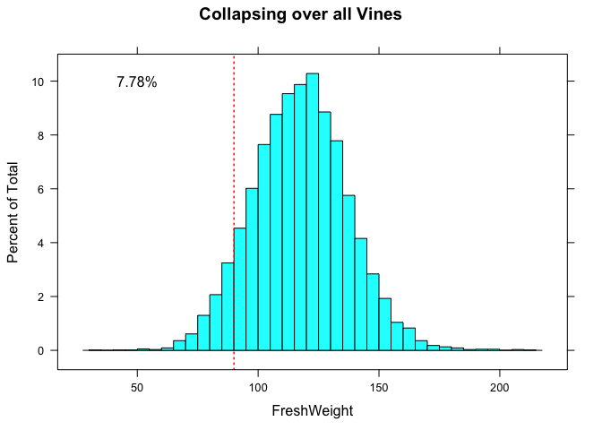

Visualise fresh weight
================

## Background

Kris Kramer-Walter and Patrick Snelgar have conducted a study of 9 G3
vines from flowering fruit harvest, the entire population of fruit were
stripped off each vine in 2020, fruit were then destructively assessed
in the fast lab. Three different canopy structure treatments
(Conventional Spur, Strung) were replicated over three vines.

This dataset provides the entire population of fruit weights in 2020,
and the underlying sampling distribution for G3, a control for the Gold
programme. From this dataset we can examine the underlying within vine
variability of fruit weights;

tabulating Numbers of fruit per vine assessed by Vine and Treatment;

``` r
knitr::kable(with(all_fruit_data, table(VineUUID, VineTreatmentNoNumber)))
```

|        | Conventional | Spur | Strung |
| :----- | -----------: | ---: | -----: |
| Vine 1 |          774 |    0 |      0 |
| Vine 2 |            0 |    0 |   1043 |
| Vine 3 |            0 | 1020 |      0 |
| Vine 4 |         1103 |    0 |      0 |
| Vine 5 |            0 | 1326 |      0 |
| Vine 6 |            0 |    0 |   1159 |
| Vine 7 |            0 | 1237 |      0 |
| Vine 8 |            0 |    0 |   1269 |
| Vine 9 |         1024 |    0 |      0 |

## Exploratory analysis

Visualizing the Fresh weight using histograms, conditioned on each Vine,
Treatment, and collapsed over Vines;

``` r
histogram(~ FreshWeight | VineUUID, data=all_fruit_data, scales=list(alternating=FALSE), 
          between=list(x=0.3, y=0.3), breaks=30, layout=c(3,3))
```

<!-- -->

``` r
histogram(~ FreshWeight | VineTreatmentNoNumber, data=all_fruit_data,
          aspect=1, main="Collapsing over replicate Vines", 
          scales=list(alternating=FALSE), between=list(x=0.3, y=0.3), breaks=30, layout=c(3,1))
```

<!-- -->

``` r
histogram(~ FreshWeight, data=all_fruit_data, scales=list(alternating=FALSE), 
          between=list(x=0.3, y=0.3), breaks=30, main="Collapsing over all Vines")
```

<!-- -->

Testing if we can collapse over vines;

``` r
summary(aov(FreshWeight ~ VineUUID, data=all_fruit_data))
```

    ##               Df  Sum Sq Mean Sq F value Pr(>F)    
    ## VineUUID       8  193937   24242   66.85 <2e-16 ***
    ## Residuals   9851 3572143     363                   
    ## ---
    ## Signif. codes:  0 '***' 0.001 '**' 0.01 '*' 0.05 '.' 0.1 ' ' 1
    ## 147 observations deleted due to missingness

``` r
library(insight)
```

    ## Warning: package 'insight' was built under R version 4.0.2

``` r
m <- lmer(FreshWeight ~ 1 | VineUUID, data=all_fruit_data)
summary(m)
```

    ## Linear mixed model fit by REML ['lmerMod']
    ## Formula: FreshWeight ~ 1 | VineUUID
    ##    Data: all_fruit_data
    ## 
    ## REML criterion at convergence: 86124.6
    ## 
    ## Scaled residuals: 
    ##     Min      1Q  Median      3Q     Max 
    ## -4.6166 -0.6767  0.0089  0.6550  5.0774 
    ## 
    ## Random effects:
    ##  Groups   Name        Variance Std.Dev.
    ##  VineUUID (Intercept)  23.9     4.889  
    ##  Residual             362.6    19.043  
    ## Number of obs: 9860, groups:  VineUUID, 9
    ## 
    ## Fixed effects:
    ##             Estimate Std. Error t value
    ## (Intercept)  117.989      1.641    71.9

``` r
get_variance(m)
```

    ## $var.fixed
    ## [1] 0
    ## 
    ## $var.random
    ## [1] 23.90049
    ## 
    ## $var.residual
    ## [1] 362.6178
    ## 
    ## $var.distribution
    ## [1] 362.6178
    ## 
    ## $var.dispersion
    ## [1] 0
    ## 
    ## $var.intercept
    ## VineUUID 
    ## 23.90049

## Summary statistics

Summary statistics for each vine;

``` r
sum_vine <- cbind(Vine=levels(all_fruit_data$VineUUID), unname(do.call(rbind.data.frame, with(all_fruit_data, tapply(FreshWeight,  VineUUID, summary)))))
colnames(sum_vine) <- c("Vine", "Min", "1st Qu", "Median","Mean", "3rd Qu", "Max", "NA's")
knitr::kable(sum_vine)
```

| Vine   |   Min |  1st Qu |  Median |     Mean |   3rd Qu |    Max | NA’s |
| :----- | ----: | ------: | ------: | -------: | -------: | -----: | ---: |
| Vine 1 | 64.48 | 113.660 | 127.950 | 126.9431 | 139.3700 | 192.23 |    7 |
| Vine 2 | 51.31 | 106.935 | 118.530 | 118.3720 | 129.7950 | 171.87 |   10 |
| Vine 3 | 33.63 | 107.595 | 122.860 | 121.5954 | 135.7300 | 189.49 |    1 |
| Vine 4 | 50.69 | 108.525 | 121.930 | 122.3091 | 135.0200 | 205.60 |    4 |
| Vine 5 | 51.81 | 100.320 | 114.450 | 114.7669 | 128.5000 | 211.49 |   18 |
| Vine 6 | 48.32 | 101.705 | 112.510 | 113.1478 | 124.5175 | 196.02 |   52 |
| Vine 7 | 65.23 | 103.310 | 117.230 | 116.6303 | 129.2800 | 168.47 |   22 |
| Vine 8 | 50.59 |  97.800 | 110.965 | 111.2160 | 123.5650 | 207.70 |   15 |
| Vine 9 | 59.13 | 105.955 | 116.945 | 117.0007 | 128.0775 | 192.31 |   18 |

Standard deviations within Vines;

``` r
sd_vine <- with(all_fruit_data, tapply(FreshWeight,  VineUUID, sd, na.rm=TRUE))
knitr::kable(sd_vine,  col.names=c("sd(X)"))
```

|        |    sd(X) |
| :----- | -------: |
| Vine 1 | 19.40376 |
| Vine 2 | 16.79510 |
| Vine 3 | 20.60119 |
| Vine 4 | 20.40306 |
| Vine 5 | 20.22703 |
| Vine 6 | 17.66092 |
| Vine 7 | 18.18912 |
| Vine 8 | 20.24913 |
| Vine 9 | 17.02309 |

The range of standard deviations across the 9 Vines is;

``` r
range(sd_vine)
```

    ## [1] 16.79510 20.60119

and the average [RMS](https://en.wikipedia.org/wiki/Root_mean_square)
standard deviation is;

``` r
sqrt(mean(sd_vine^2))
```

    ## [1] 19.00577

## Sampling Distribution

As we have the entire population of fruit picked and assessed for these
9 Vines, we have the underlying sampling distribution. This distribution
visually appears similar to an underlying normal distrubution, testing
for normality using normal Q-Q plots conditioned by Vine;

``` r
qqmath(~ FreshWeight | VineUUID, data=all_fruit_data,
       distribution = function(p) qnorm(p, mean=0, sd=1), main="Normal Q-Q Plot",
       ylab="Sample Quantiles", xlab="Theoretical quantiles",
       scales=list(alternating=FALSE), between=list(x=0.3, y=0.3),
       breaks=30, layout=c(3,3), pch=16, cex=0.5, aspect=1,
      prepanel = prepanel.qqmathline,
       panel = function(x, ...) {
         panel.qqmath(x, ...)
         panel.qqmathline(x, ...)
       })
```

<!-- -->

Testing for normality using normal Q-Q plots by Treatment collapsing
over replicates;

``` r
qqmath(~ FreshWeight | VineTreatmentNoNumber, data=all_fruit_data,
       distribution = function(p) qnorm(p, mean=0, sd=1), main="Normal Q-Q Plot",
       ylab="Sample Quantiles", xlab="Theoretical quantiles",
       scales=list(alternating=FALSE), between=list(x=0.3, y=0.3),
       breaks=30, layout=c(3,1), pch=16, cex=0.5, aspect=1,
      prepanel = prepanel.qqmathline,
       panel = function(x, ...) {
         panel.qqmath(x, ...)
         panel.qqmathline(x, ...)
       })
```

<!-- -->

Testing for normality using normal Q-Q plots collapsing over all Vines;

``` r
qqmath(~ FreshWeight, data=all_fruit_data,
       distribution = function(p) qnorm(p, mean=0, sd=1), main="Normal Q-Q Plot",
       ylab="Sample Quantiles", xlab="Theoretical quantiles",
       scales=list(alternating=FALSE), between=list(x=0.3, y=0.3),
       breaks=30, pch=16, cex=0.5, aspect=1,
      prepanel = prepanel.qqmathline,
       panel = function(x, ...) {
         panel.qqmath(x, ...)
         panel.qqmathline(x, ...)
       })
```

<!-- -->
